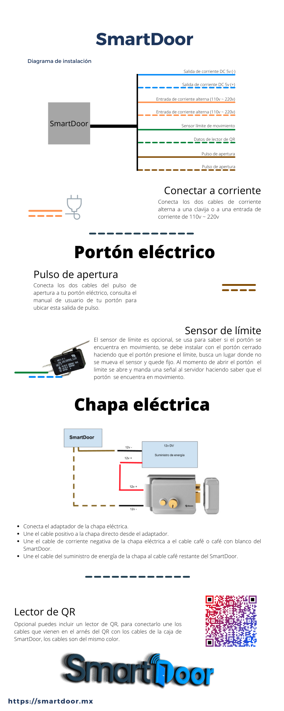

#  Smartdoor - Control de acceso "iot"

Convierte tu porton, puerta de acceso intelligente. Incluye diagrama de hardware, gerber, firmware, web app, todo lo que ocupas para montar un servidor con este servicio, incluso implementacion de Paypal para cobro de uso. 

Esta hecho sobre una placa ESP01 o ESP8266 que solo tiene 1mb de memoria, sin enbargo permite enviar fotografias de videovigilancia sin importar el tamano de la imagen a tu servidor.

